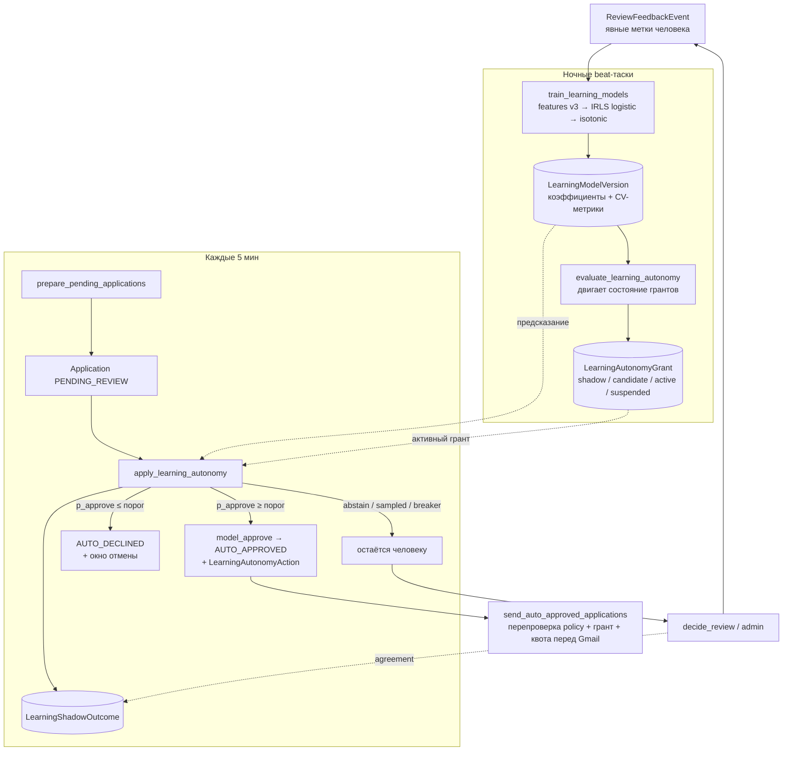

# Дизайн: автономия learning-контура («доверенный аппрувер»)

- **Дата:** 2026-08-31
- **Статус:** проект, ожидает ревью оператора
- **Ветка:** `feature/learning-autonomy`
- **Связанные документы:** [`docs/review-learning.md`](../../review-learning.md),
  [`docs/auto-send-policy.md`](../../auto-send-policy.md),
  [`docs/threat-model.md`](../../threat-model.md),
  [`docs/architecture.md`](../../architecture.md)

---

## 1. Контекст и проблема

Сейчас learning-контур (`app/learning/service.py`) запоминает явные решения владельца
по очереди «Требуют решения» и **только** переупорядочивает эту очередь и выдаёт одну
строку-подсказку. `docs/review-learning.md` явно фиксирует: контур «не получает права
отправлять, автоматически одобрять или блокировать отклики».

Оператор хочет, чтобы при достаточном массиве данных learning-контур мог **сам
отклонять и сам отправлять** отклики, снимая ручную рутину.

Это меняет одно из ключевых свойств системы, поэтому автономия проектируется как
**ограниченная, наблюдаемая и обратимая** способность, подчинённая существующему
детерминированному policy engine.

### 1.1. Что мешает сегодня

| Слой | Ограничение |
|---|---|
| Признаки | Только категориальные (9 измерений). Нет числовых, нет сигналов LLM (`overall_fit`, risks), нет времени, нет per-source. |
| Модель | По-размерный подсчёт approve/reject со сглаживанием Beta. Нет регуляризации, нет взаимодействий, **нет калибровки вероятности** — выход `_score()` это эвристическое число 5–95, а не `P(approve)`. |
| Порог готовности | `MINIMUM_LABELS = 6` на измерение. Годится для подсказки, не для действия. |
| Применение | Только сортировка очереди. Нет пути «модель действует». |
| Метрики | Нет held-out метрик, нет ECE, нет доказательной базы «модели можно доверять». |

### 1.2. Что уже есть и переиспользуется

- **Автономная отправка в системе уже существует**: `PolicyDecision.AUTO_APPROVED` →
  beat-таск `send_auto_approved_applications` → укреплённый путь `EmailService`
  (атомарное резервирование дневного слота, перепроверка policy непосредственно перед
  Gmail, idempotency key, обработка `delivery_unknown`).
- **Прецедент альтернативного пути в `policy/engine.py`**: `minimum_catchup_active`
  уже ослабляет ровно правила `match_auto_apply`, `match_not_skipped`,
  `overall_score_threshold`. «Доверенная модель» становится вторым таким путём — с
  гораздо большим числом предохранителей.
- **Каузальная атрибуция** в `record_decision`: отказ по причине «Зарплата» бьёт
  только по признакам зарплаты. Свойство сохраняется и переносится в новую модель.
- **Fingerprints** профиля/предпочтений/резюме/контента на `MatchEvaluation` и
  `ReviewFeedbackEvent` — используются для инвалидации грантов при изменениях.
- **`ReviewFeedbackEvent`** остаётся единственным источником обучающих меток.

---

## 2. Цель и не-цели

### 2.1. Цель

1. Заменить наивную модель на **интерпретируемую калиброванную** (L2-логистическая
   регрессия + изотоническая калибровка), выдающую `P(approve | job)` с
   доверительным интервалом.
2. Ввести **shadow-режим**: модель предсказывает на каждой review-заявке, решение
   сравнивается с решением человека, накапливается доказательная база (scorecard).
3. Ввести **градацию автономии** по способностям (`auto_reject`, затем `auto_send`)
   и сегментам, с явными, консервативными, параметризуемыми порогами «достаточных
   данных».
4. Дать модели право действовать **ровно в объёме прав человека-ревьюера** и не
   больше: `auto_reject` = то же, что `ApplicationService.reject()`; `auto_send` =
   стать вторым способом удовлетворить те же 3 «мягких» правила policy engine, что
   уже ослабляет `minimum_catchup_active`.
5. Предохранители: per-decision confidence + feature-support gate, rate-limit,
   circuit breakers (disagreement / novelty / delivery / staleness), sampling,
   окно отмены авто-отказа, независимые kill switch, полный audit.

### 2.2. Не-цели

- Модель **не** становится вторым policy engine и **не** может ослабить ни одно
  hard-правило (scam, prompt-injection, verified contact/resume, confirmed facts,
  vacancy active, source healthy, pause, kill switch, idempotency, daily limit).
- Модель **не** выбирает получателя, вложение, текст письма, лимит — всё это
  по-прежнему серверная детерминированная логика.
- Автономные решения **не** становятся обучающими метками.
- Не вводится RBAC/multi-tenant (система остаётся одно-пользовательской).
- Не вводится онлайн-обучение: модель переобучается пакетно (ночью).
- Не добавляется `scikit-learn` — оценщики реализуются на `numpy` (см. §5.2).

---

## 3. Ключевые решения (из брейншторма)

| Вопрос | Решение |
|---|---|
| Подход интеграции | **A. «Доверенный аппрувер»** — альтернативный путь в policy engine, зеркало `minimum_catchup_active`. Hard-правила без изменений. |
| Выкатка способности `auto_send` | Стадия **C → A**: первые 30 дней active-send модель отправляет только там, где LLM-`decision = AUTO_APPLY`; затем разрешается инициировать отправку на `PREPARE_FOR_REVIEW`. |
| Порядок способностей | `auto_reject` (обратимо) → потом `auto_send` (необратимо). |
| Тип модели | Интерпретируемая: L2-логистическая регрессия с каузальным маскированием признаков + изотоническая калибровка вероятности. Инспектируемые коэффициенты. |
| Объём данных оператора | Десятки решений в неделю → автономия **глобальная** (один сегмент `global` на профиль), опционально разбиение по категории активного резюме при ≥2 активных резюме разных категорий и ≥80 меток в каждой. Пороги адаптивные, shadow-период — месяцы. |
| Новый статус заявки | `ApplicationStatus.AUTO_DECLINED`. Колонка `native_enum=False` → `ALTER TYPE` не требуется; всё равно нужна миграция для новых таблиц. |
| Что именно ослабляет модель при `auto_send` | Только `category_allowed_for_auto_send` и `overall_score_threshold` (стадия C); плюс `match_auto_apply` (стадия A). Всё остальное — включая `mandatory_requirements_met`, verified contact/resume, `letter_validated`, `global_pause_off`, `daily_limit` и весь hard-набор — модель не ослабляет. |
| Зависимости | `numpy` добавляется в core-deps. Оценщики (IRLS logistic, PAVA isotonic) — свои, покрыты фикстур-тестами. |

---

## 4. Обзор архитектуры



Инвариант: любое автономное действие проходит **весь** существующий hard-набор
policy engine и весь укреплённый путь `EmailService`. Модель влияет только на
3 «мягких» правила и на отмену неотправленной заявки.

---

## 5. Компоненты

### 5.1. `app/learning/features.py` — извлечение признаков v3

`FEATURE_SPEC_VERSION = "features-v3"`. Расширяет снимок, который `record_decision`
кладёт в `ReviewFeedbackEvent.feature_snapshot`. Исторические события
(`review-v1/v2`, будущий `review-v3`) используются для того подмножества групп,
которое в них восстановимо (логика совместимости как сейчас для v1→v2).

**Группы признаков:**

| Группа | Признаки | Маскирование при отказе |
|---|---|---|
| `categorical` (как сейчас, 9 измерений) | one-hot: `category`, `title` (явный словарь нормализованных токенов — top-K по частоте с min-support, как сейчас, ради человекочитаемых меток), `city`, `area`, `schedule`, `workplace`, `experience`, `company` (аналогично, явный словарь), `salary_state` | **Да** — по `_REJECTION_DIMENSIONS[reason]`; approve активирует все; `OTHER` активирует только числовые |
| `numeric` | `salary_gap` = clip((midpoint(job) − minimum_salary)/minimum_salary, −1, 3) + флаг `salary_missing`; `overall_fit`, `resume_fit`, `preference_fit` (÷100); `n_missing_requirements` (cap 5), `n_risks` (cap 5); `llm_decision` one-hot (4) | **Нет** — числовые сигналы каузальны при любой причине отказа |
| `context` | `source_key` one-hot (по `adapter_type`); `age_days` бакетами (`0-3/4-7/8-30/31+`) | Нет |
| `dimension_observed` | по одному индикатору на каждое из 9 категориальных измерений — «это измерение активно в данной строке» (поглощает каузальный per-dimension baseline; заменяет текущий `_DimensionStat`-baseline) | Формируется из маски |

**Веса строк (time-decay):** `w = 0.5 ** (age_days / learning_model_half_life_days)`,
`half_life` по умолчанию 120 дней. Применяются к вкладу строки в loss.

**Каузальное маскирование строки** (это и есть перенос текущей каузальной модели в
линейную): для строки-отказа с причиной `r` все one-hot признаки категориальных
групп, не входящих в `_REJECTION_DIMENSIONS[r]`, обнуляются. Обнулённый one-hot
признак не даёт градиента своему коэффициенту → строка «молчит» об этих измерениях,
ровно как сейчас. Для approve активны все группы. `VACANCY_PROBLEM` и не-eligible
события в обучение не идут (как сейчас, `learning_eligible`).

**Выход:** `FeatureVector` — разрежённый вектор фиксированной размерности (порядок
задаётся `FeatureSpec`, сериализуется вместе с моделью) + список присутствующих
категориальных значений (для `support_ok`).

### 5.2. `app/learning/model.py` — обучение и предсказание

**Зависимость:** `numpy` (добавляется в `pyproject.toml` core-deps; альтернатива —
`scikit-learn` — отклонена ради минимальной supply-chain поверхности; см. §11).

**Обучение** (`train(labels: list[ReviewFeedbackEvent], spec: FeatureSpec) -> TrainedModel`):

1. Собрать матрицу `X` (n×d), вектор `y` (approve=1), веса `w` (time-decay), с
   каузальным маскированием строк.
2. **L2-логистическая регрессия** методом IRLS (итеративно перевзвешенные наименьшие
   квадраты, ридж-штраф `λ` на все коэффициенты кроме intercept). ~25 строк numpy,
   детерминирована, тестируется против заранее посчитанных фикстур. `λ` подбирается
   по сетке через time-series CV (минимизация weighted log-loss).
3. **Изотоническая калибровка (PAVA)** на out-of-fold предсказаниях time-series CV:
   `raw_logit → p_calibrated` монотонной ступенчатой функцией. ~15 строк numpy.
4. **CV-метрики**: weighted AUC, weighted log-loss, **ECE** (expected calibration
   error, 10 бинов) — по out-of-fold предсказаниям.
5. Частоты категориальных значений (для `support_ok`).

**Предсказание** (`predict(model: TrainedModel, fv: FeatureVector) -> Prediction`):

```
Prediction(
    p_approve: float,            # калиброванная вероятность
    ci_low: float, ci_high: float,  # Wilson-интервал бина калибровки (n сэмплов бина)
    support_ok: bool,            # все присутствующие кат. значения встречались ≥ learning_min_feature_support раз
    top_contributions: list[(feature_label, logit_delta, support)],  # ±3 сильнейших, человекочитаемо
)
```

CI: для предсказанного `p` берётся бин изотонической функции, к его `(approve, n)`
применяется интервал Уилсона (95%). Если `n < 20` — интервал расширяется до `[0,1]`
(т.е. решение не может быть уверенным). Feature-support gate — отдельный флаг.

**`ReviewLearningService.score()`** в Фазе 1 переключается на `predict(...).p_approve`
для сортировки очереди (низкорисковый выигрыш; строковая подсказка берётся из
`top_contributions`). Старый `_score()` удаляется вместе с тупиковыми ветками
статистики; `summary()` сохраняется для UI-счётчиков, но «ready» вычисляется по
CV-метрикам новой модели.

### 5.3. `app/learning/autonomy.py` — гранты, scorecard, предохранители

**`evaluate_grants(session, profile_id)`** (ночной таск): для каждой пары
`(segment_key, capability)` пересчитывает состояние гранта по scorecard и
CV-метрикам (см. §7). Переходы:

```
shadow ──(пороги кандидата)──► candidate ──(окно подтверждения)──► active
  ▲                                                                  │
  └──────────────── suspended ◄──(circuit breaker / изменение)───────┘
      (ручной возврат оператора только через shadow)
```

- `shadow` → `candidate`: выполнены пороги данных + CV-метрик.
- `candidate` → `active`: держится ≥ `confirmation_window_days` без деградации
  метрик + scorecard-совпадение на shadow-окне ≥ порога.
- любой → `suspended`: сработал breaker, либо изменились
  profile/preference/resume fingerprints или `POLICY_VERSION` /
  `FEATURE_SPEC_VERSION` / `MATCHING_RULES_VERSION`.
- `suspended` → только `shadow` (нужен новый период накопления), вручную оператором
  или автоматически после `cooldown_days`.

**`decide(session, application, evaluation, job, prediction, grants)`**
(вызывается из `apply_learning_autonomy`):

1. Проверить дневные лимиты и глобальные breaker-флаги профиля.
2. С вероятностью `learning_autonomy_sampling_rate` → вернуть `HOLD_FOR_SAMPLE`
   (действия нет, пишем `LearningShadowOutcome(sampled=True)`).
3. Если `not prediction.support_ok` или `ci_width > learning_ci_max_width` →
   `ABSTAIN`.
4. `auto_send` active-грант и `p_approve ≥ learning_send_approve_threshold`
   (дефолт 0.90) → `MODEL_APPROVE(stage)`.
5. `auto_reject` active-грант и `p_approve ≤ learning_reject_threshold`
   (дефолт 0.12) → `MODEL_DECLINE`.
6. Иначе → `HUMAN` (остаётся в очереди).

**Circuit breakers** (`autonomy.py`, проверяются в `evaluate_grants` и перед
`decide`):

| Breaker | Условие | Действие |
|---|---|---|
| disagreement | на скользящем окне `disagreement_window` доля несовпадений «модель vs человек» на would-act кейсах > `learning_disagreement_suspend_rate` (дефолт 0.15) | suspend соответствующего гранта + `Alert` |
| novelty | доля заявок с `support_ok = False` за 7 дней растёт выше `novelty_suspend_rate` (дефолт 0.4) | suspend всех грантов сегмента + `Alert` |
| delivery | `N` подряд `delivery_unknown`/`failed` на модельных отправках (дефолт 2) | suspend `auto_send` + `Alert` |
| staleness | mismatch fingerprints / версий | грант → `shadow` |
| quota | модельных отправок сегодня ≥ `learning_autonomy_max_sends_per_day` | `decide` не выдаёт `MODEL_APPROVE` до конца суток |

---

## 6. Модель данных

Новая миграция `migrations/versions/xxxx_learning_autonomy.py`. Все таблицы —
append-oriented, кроме `LearningAutonomyGrant` (мутабельное состояние).

### `LearningModelVersion`
| Поле | Тип | Комментарий |
|---|---|---|
| `id` | UUID PK | |
| `profile_id` | FK user_profiles CASCADE, index | |
| `segment_key` | str(64) | `"global"` или `"resume_category:<cat>"` |
| `feature_spec_version` | str(32) | `"features-v3"` |
| `algorithm` | str(32) | `"l2_logistic_isotonic"` |
| `coefficients` | JSON | `{feature_name: weight}` + `intercept` |
| `feature_spec` | JSON | порядок и определения признаков (для воспроизводимого predict) |
| `calibration` | JSON | ступени PAVA `[(logit_lo, logit_hi, p, n, approve)]` |
| `feature_frequencies` | JSON | `{categorical_value: count}` |
| `n_labels`, `n_approved`, `n_rejected` | int | |
| `cv_auc`, `cv_logloss`, `cv_ece` | float | |
| `trained_at` | datetime tz | |

Уникальность: `(profile_id, segment_key, trained_at)`. Старые версии не удаляются
(история, привязка автономных решений к точной версии).

### `LearningAutonomyGrant`
| Поле | Тип | Комментарий |
|---|---|---|
| `id` | UUID PK | |
| `profile_id` | FK CASCADE, index | |
| `segment_key` | str(64) | |
| `capability` | enum `LearningCapability` (`auto_reject`, `auto_send`) | |
| `state` | enum `LearningGrantState` (`shadow`, `candidate`, `active`, `suspended`) | |
| `stage` | str(1), nullable | для `auto_send`: `"C"` / `"A"` |
| `model_version_id` | FK LearningModelVersion RESTRICT, nullable | текущая привязанная версия |
| `thresholds_snapshot` | JSON | значения порогов на момент последнего перехода |
| `scorecard` | JSON | скользящие агрегаты (см. §7) |
| `state_changed_at` | datetime tz | |
| `suspended_reason` | str(128), nullable | |
| `binding_fingerprints` | JSON | profile/preference/resume хэши + версии policy/feature/matching |

Уникальность: `(profile_id, segment_key, capability)`.

### `LearningShadowOutcome`
| Поле | Тип | Комментарий |
|---|---|---|
| `id` | UUID PK | |
| `profile_id` | FK CASCADE, index | |
| `application_id` | FK applications CASCADE, index | |
| `model_version_id` | FK LearningModelVersion SET NULL | |
| `segment_key` | str(64) | |
| `p_approve`, `ci_low`, `ci_high` | float | |
| `support_ok` | bool | |
| `would_decide` | enum (`approve`, `reject`, `abstain`) | |
| `human_decision` | enum (`approved`, `rejected`), nullable | заполняется при решении человека |
| `human_reason` | enum `ReviewReason`, nullable | |
| `agreed` | bool, nullable | |
| `sampled` | bool | было ли принудительно оставлено человеку |
| `created_at` | datetime tz, index | |

Уникальность: `(application_id, model_version_id)`.

### `LearningAutonomyAction`
| Поле | Тип | Комментарий |
|---|---|---|
| `id` | UUID PK | |
| `profile_id` | FK CASCADE, index | |
| `application_id` | FK applications CASCADE, unique | одно автономное действие на заявку |
| `capability` | enum `LearningCapability` | |
| `stage` | str(1), nullable | |
| `model_version_id` | FK RESTRICT | |
| `grant_id` | FK LearningAutonomyGrant RESTRICT | |
| `p_approve`, `ci_low`, `ci_high` | float | |
| `top_contributions` | JSON | |
| `reverted` | bool, default False | оператор вернул авто-отказ |
| `reverted_at` | datetime tz, nullable | |
| `finalized` | bool, default False | авто-отказ дошёл до `CANCELLED` |
| `created_at` | datetime tz, index | |

Имя файла миграции — `<rev>_learning_autonomy.py` (`<rev>` генерирует alembic).

### `ApplicationStatus.AUTO_DECLINED`
Новое значение enum (колонка `native_enum=False` → `ALTER TYPE` не нужен).
Переходы в `app/applications/states.py`:
```
PENDING_REVIEW -> { ..., AUTO_DECLINED }
AUTO_DECLINED  -> { PENDING_REVIEW (revert), CANCELLED (finalize) }
```
Beat-таск `finalize_auto_declined` переводит `AUTO_DECLINED` старше
`learning_auto_decline_revert_hours` (дефолт 36) в `CANCELLED`.

---

## 7. Лестница градации («достаточный массив данных»)

Все значения — поля `Settings` с консервативными дефолтами (для «десятки/неделю»).
Пороги проверяются в `evaluate_grants`; **каждый** порог блокирует переход
независимо (регресс-тест на каждый).

### 7.1. `shadow` (всегда, как только модель обучилась)
- `n_labels ≥ learning_shadow_min_labels` (дефолт 40) — иначе модель не строится.
- Действий нет. На каждой review-заявке пишется `LearningShadowOutcome`.
- Scorecard в дневном отчёте: confusion matrix, agreement, ECE, AUC.

### 7.2. `shadow → candidate → active` для `auto_reject`
| Порог | Дефолт | Поле |
|---|---|---|
| годных меток всего | 120 | `learning_reject_min_labels` |
| reject / approve по отдельности | 30 / 30 | `learning_reject_min_per_outcome` |
| time-series CV AUC | ≥ 0.72 | `learning_reject_min_auc` |
| CV ECE | ≤ 0.08 | `learning_reject_max_ece` |
| окно shadow | 90 дней | `learning_reject_shadow_window_days` |
| would-reject кейсов в окне | ≥ 40 | `learning_reject_shadow_min_cases` |
| agreement на would-reject | ≥ 0.93 | `learning_reject_shadow_min_agreement` |
| среди несовпадений | 0 кейсов «модель отклонила, человек одобрил и отправил» | жёстко |
| окно подтверждения `candidate` | 14 дней без деградации | `learning_confirmation_window_days` |

### 7.3. `shadow → candidate → active` для `auto_send`
Дополнительное предусловие: `auto_reject` в `active` ≥ `learning_send_prereq_days`
(дефолт 60).

| Порог | Дефолт | Поле |
|---|---|---|
| годных меток всего | 250 | `learning_send_min_labels` |
| approve | ≥ 80 | `learning_send_min_approved` |
| CV ECE | ≤ 0.05 | `learning_send_max_ece` |
| CV AUC | ≥ 0.78 | `learning_send_min_auc` |
| отдельный shadow на would-send | ≥ 30 кейсов | `learning_send_shadow_min_cases` |
| agreement на would-send | ≥ 0.97 | `learning_send_shadow_min_agreement` |
| несовпадений по причинам role/company/scam/requirements | 0 | жёстко |
| стадия C: ослабляет только `category_allowed_for_auto_send` + `overall_score_threshold`, LLM обязан быть `AUTO_APPLY` | первые 30 дней в `active` | `learning_send_stage_c_days` |
| стадия A: дополнительно ослабляет `match_auto_apply` | после стадии C | — |

### 7.4. Гейт на каждое решение (независимо от градации)
- `auto_send`: `p_approve ≥ learning_send_approve_threshold` (0.90).
- `auto_reject`: `p_approve ≤ learning_reject_threshold` (0.12).
- `ci_high − ci_low ≤ learning_ci_max_width` (0.15).
- `support_ok` (все присутствующие категориальные значения встречались
  ≥ `learning_min_feature_support` раз, дефолт 5) — иначе `ABSTAIN`.

### 7.5. Scorecard (поле `LearningAutonomyGrant.scorecard`)
Скользящие агрегаты за окно, обновляются в `evaluate_grants` из
`LearningShadowOutcome`:
```json
{
  "window_days": 90,
  "cases_total": 210, "would_approve": 140, "would_reject": 55, "would_abstain": 15,
  "agreement_overall": 0.94,
  "would_reject_cases": 55, "would_reject_agreement": 0.95,
  "would_send_cases": 34, "would_send_agreement": 0.97,
  "hard_disagreements": 0,
  "cv_auc": 0.79, "cv_ece": 0.045,
  "updated_at": "2026-08-31T21:15:00Z"
}
```

---

## 8. Предохранители (сводно)

- **Rate-limit**: автономных отправок ≤ `learning_autonomy_max_sends_per_day`
  (дефолт 1), отдельно от и ниже `JobPreference.maximum_daily_applications`.
  Проверяется и в `decide`, и hard-правилом policy engine
  `autonomous_send_within_quota`, и повторно перед Gmail.
- **Sampling**: `learning_autonomy_sampling_rate` (0.1) would-act кейсов
  принудительно уходит человеку; результат обновляет scorecard.
- **Circuit breakers**: disagreement / novelty / delivery / staleness / quota
  (см. §5.3).
- **Окно отмены авто-отказа**: `AUTO_DECLINED` виден в дневном отчёте и в UI
  `learning_auto_decline_revert_hours`; одна кнопка «вернуть» → `PENDING_REVIEW`.
- **Kill switches**:
  - `Settings.autonomous_learning_enabled` — дефолт **false**, deployment-уровень.
  - `Settings.emergency_email_kill_switch` и `JobPreference.global_pause` — уже
    режут отправку, продолжают действовать.
  - MCP-тул `pause_autonomous_learning` / тумблер панели — мгновенно переводит все
    гранты профиля в `suspended`.
  - Тумблеры по способности и сегменту.
  - Всё в `AuditEvent`.
- **Гигиена обратной связи**: автономные решения не создают `ReviewFeedbackEvent`.
  Меткой становится только решение человека, в т.ч. на sampled-кейсах и при
  revert/override.
- **Автономное действие не относится к learning как метка даже косвенно**: при
  revert авто-отказа человек может затем принять явное решение — оно и станет
  меткой.

---

## 9. Интеграция с существующим кодом

### 9.1. `app/policies/engine.py`

**Суть intergation.** Заявка с LLM-`decision = AUTO_APPLY`, пройденными hard-правилами
и высоким score всё равно попадает в `PENDING_REVIEW`, если её категория не в ручном
allowlist `JobPreference.auto_send_categories` (`category_allowed_for_auto_send` —
мягкое правило) или score ниже `minimum_auto_send_score`. Именно эти два случая
должна закрывать доверенная модель: «вы одобряете эту категорию в 97% случаев —
ручной allowlist курировать не нужно». Стадия A дополнительно закрывает случай, когда
LLM сказал `PREPARE_FOR_REVIEW`, а не `AUTO_APPLY`.

- Новый параметр `evaluate(..., trusted_model_approval: TrustedModelApproval | None = None)`.
  `TrustedModelApproval` — frozen dataclass: `capability`, `model_version_id`,
  `grant_id`, `p_approve`, `stage`, `relaxes: frozenset[str]`.
- `relaxes` формируется в `autonomy.py` из состояния гранта:
  - стадия C = `{"category_allowed_for_auto_send", "overall_score_threshold"}`
    (LLM-`decision` при этом обязан быть `AUTO_APPLY` — `match_auto_apply` не ослаблен);
  - стадия A = стадия C + `{"match_auto_apply"}`.
- Ослабляются **только** правила из `relaxes`:
  ```python
  trusted = trusted_model_approval is not None
  def relaxed(name): return trusted and name in trusted_model_approval.relaxes
  rule("category_allowed_for_auto_send", relaxed("category_allowed_for_auto_send") or category in auto_categories)
  rule("overall_score_threshold", minimum_catchup_active or relaxed("overall_score_threshold") or evaluation.overall_fit >= preferences.minimum_auto_send_score)
  rule("match_auto_apply", minimum_catchup_active or relaxed("match_auto_apply") or evaluation.decision == MatchDecision.AUTO_APPLY)
  ```
  `match_not_skipped` **не** ослабляется: `SKIP` → `PolicyDecision.SKIPPED` →
  `CANCELLED`, такие заявки вне области `apply_learning_autonomy` (работает только с
  `PENDING_REVIEW`).
- **Не ослабляются никогда** (даже при доверенной модели): `auto_send_enabled`,
  `global_pause_off`, `mandatory_requirements_met`, `verified_email_contact`,
  `contact_verified`, `resume_active_verified`, `letter_validated`, `daily_limit` и
  весь `hard_block_rules`.
- Что продолжает защищать при ослабленном `category_allowed_for_auto_send`:
  `forbidden_categories` отсекается раньше детерминированным prefilter (`SKIP`/`BLOCK`,
  сюда не доходит); `support_ok` требует, чтобы значение категории встречалось в
  обучении ≥ `learning_min_feature_support` раз (новая категория → `ABSTAIN`);
  высокий порог `p_approve`; длинный shadow; квота; sampling.
- Новое **hard-правило** `autonomous_send_within_quota`: добавляется в список
  `failed` только когда `trusted_model_approval` присутствует и
  `capability == auto_send` и `model_sends_today >= settings.learning_autonomy_max_sends_per_day`.
  Входит в `hard_block_rules`.
- `policy_result` дополняется блоком `trusted_model_approval`
  (`model_version_id`, `p_approve`, `stage`, `grant_id`) и `approved_by`.
- `POLICY_VERSION` инкрементируется (изменение логики правил).
- Регресс-тест: `trusted_model_approval=None` → поведение бит-в-бит прежнее.

### 9.2. `app/applications/service.py`
- Новый метод `ApplicationService.model_approve(session, application, trusted_ctx)`:
  повторяет проверки `approve()` (staleness, active, `content_validated`, привязка
  evaluation), затем `policy_engine.apply(..., trusted_model_approval=trusted_ctx)`;
  если результат `AUTO_APPROVED` — статус `AUTO_APPROVED`, иначе `ApplicationPreparationError`
  (модель не может протолкнуть заявку, которую hard-правила не пускают).
- Новый метод `ApplicationService.model_decline(session, application, action_meta)`:
  `ensure_transition(PENDING_REVIEW → AUTO_DECLINED)`, статус `AUTO_DECLINED`,
  запись `LearningAutonomyAction(capability=auto_reject)`.
- Новый метод `ApplicationService.revert_auto_decline(session, application_id)`:
  `AUTO_DECLINED → PENDING_REVIEW`, `action.reverted = True`.
- `prepare_pending_applications` дополнительно пишет `LearningShadowOutcome` для
  каждой заявки, у которой есть обученная модель сегмента (что модель *сделала бы*).

### 9.3. `app/scheduler/` (celery_app.py + tasks.py)
Новые beat-таски (все `_run_locked_periodic`, отдельные Redis-locks):

| Таск | Расписание | Очередь |
|---|---|---|
| `train_learning_models` | `crontab(minute=30, hour=1)` | `matching` |
| `evaluate_learning_autonomy` | `crontab(minute=45, hour=1)` | `matching` |
| `apply_learning_autonomy` | `300.0` (5 мин) | `applications` |
| `finalize_auto_declined` | `crontab(minute=20, hour="*/6")` | `applications` |

`apply_learning_autonomy` пропускается целиком, если
`settings.autonomous_learning_enabled is False` (пишет только shadow).

### 9.4. `app/email/service.py`
- В обеих точках повторной проверки policy перед Gmail
  (`send_auto_approved_applications` и `send_application`): если у заявки есть
  `LearningAutonomyAction(capability=auto_send)` — загрузить грант, проверить, что
  он всё ещё `active` и не `suspended`, восстановить `TrustedModelApproval`,
  передать в `PolicyEngine.evaluate(...)`. Если грант больше не `active` →
  `evaluate` вернёт не-`AUTO_APPROVED` → заявка не отправляется (безопасно,
  существующая семантика «policy перепроверяется перед отправкой»).
- Delivery breaker: `N` подряд `delivery_unknown`/`failed` на модельных отправках →
  `autonomy.suspend(grant, "delivery_breaker")` + `Alert`.

### 9.5. `app/settings/config.py`
Все поля из §7 + §8. Валидатор `validate_secure_production`:
- если `autonomous_learning_enabled` и `environment == "production"` →
  `llm_provider != "mock"` (уже есть) и рекомендованный (не обязательный) флаг
  в лог при `real_email_delivery_enabled is False` (автономная отправка без
  реальной доставки бессмысленна, но не запрещена — shadow допустим).

### 9.6. `app/admin/routes.py` + `app/mcp/server.py`
- MCP-тулзы: `get_learning_autonomy_status(profile_id?)`,
  `set_learning_autonomy(segment_key, capability, target_state, profile_id?)`
  (только `shadow`/`active`/`suspended` вручную; `candidate` — только автоматически),
  `pause_autonomous_learning(profile_id?)`,
  `list_autonomous_actions(limit, profile_id?)`,
  `revert_auto_decline(application_id)`.
- Панель: раздел «Автономия обучения» — scorecard, состояние грантов, список
  автономных действий с кнопкой «вернуть», история версий модели с метриками.
- Все write-операции → `AuditEvent` (`review_learning.autonomy_changed`,
  `application.model_approved`, `application.model_declined`,
  `application.auto_decline_reverted`).
- Дневной отчёт (`app/reports/service.py`): добавить блок `learning_autonomy`
  (shadow scorecard, число модельных approve/decline/reverted за день).

### 9.7. `docs/`
Обновить `review-learning.md` (новая модель, автономия, границы),
`auto-send-policy.md` (путь «доверенный аппрувер», hard-правило квоты),
`threat-model.md` (T21–T24, см. §10), `architecture.md` (слой learning).

---

## 10. Безопасность и дельта threat-model

| ID | Угроза | Меры |
|---|---|---|
| T21 | Модель выучила смещённый/«отравленный» паттерн из череды нерепрезентативных меток → авто-отклоняет хорошие или авто-отправляет плохие | Каузальная атрибуция; ECE-гейт; длинный shadow; per-decision confidence + support gate; sampling; disagreement breaker; rate-limit; окно отмены; **все hard-правила (scam/injection/facts/contact) продолжают действовать**; автономия off по умолчанию + отдельное авторизованное включение |
| T22 | Петля обратной связи: модель учится на своих же решениях → дрейф/переуверенность | Автономные действия не создают меток; только явные решения человека (в т.ч. sampled/revert) |
| T23 | Сдвиг распределения (новый источник/тип вакансий) → модель действует вне компетенции | Novelty breaker; support gate; staleness→shadow при изменении конфигурации/версий |
| T24 | Использование устаревшего гранта в момент отправки (грант приостановлен после постановки в очередь) | Перед Gmail грант и квота перечитываются, `TrustedModelApproval` пересобирается; suspended грант → заявка не отправляется |

Свойства, которые сохраняются без изменений: sender принимает только
`application_id`; recipient/attachment/limit/текст — серверные; idempotency;
`delivery_unknown` не retry-ится; degradation источника останавливает downstream;
`global_pause` и `EMERGENCY_EMAIL_KILL_SWITCH` имеют приоритет.

Включение автономии в production — **отдельное привилегированное действие**
(как `REAL_EMAIL_DELIVERY_ENABLED`), не побочный эффект обновления предпочтений.

---

## 11. Рассмотренные альтернативы

| Альтернатива | Почему отклонена |
|---|---|
| Подход B (отдельный сервис, имитирующий человека, policy не трогаем) | Manually-`APPROVED` требует ручного `send_application`; пришлось бы дублировать оркестрацию отправки (лимит, idempotency, `delivery_unknown`) или вводить статус `MODEL_APPROVED` со своим sender-таском |
| Подход C целиком (модель только вето + ускоритель LLM-пути) | Не даёт «модель сама отправляет» на `PREPARE_FOR_REVIEW`; используется только как **первая стадия** способности send |
| `scikit-learn` | Тянет `scipy`/`joblib`/`threadpoolctl` — заметная supply-chain поверхность для проекта с акцентом на минимизацию зависимостей; нужная функциональность (L2 logistic, isotonic, TimeSeriesSplit) реализуется на `numpy` в ~60 строк и покрывается фикстур-тестами. Если оператор предпочтёт `sklearn` — заменяемо в `model.py` без изменения остального дизайна |
| Gradient boosting / чёрный ящик | Оператор выбрал интерпретируемую модель; данных (десятки/неделю) недостаточно; противоречит принципу объяснимости из threat-model |
| Мелкая посегментная автономия (категория×город) | Данных не хватит на сегмент; сегмент = `global` (+ опц. по категории резюме) |
| `AUTO_DECLINED` как `CANCELLED` + флаг | Скрытое состояние хуже явного; `native_enum=False` делает добавление enum-значения дешёвым |

---

## 12. Тестирование

**Unit (`tests/unit/test_learning_model.py`, `test_learning_autonomy.py`):**
- IRLS logistic против заранее посчитанной фикстуры (коэффициенты, сходимость).
- PAVA isotonic против фикстуры (монотонность, точные ступени).
- Каузальное маскирование: строка-отказ `reason=SALARY` не двигает коэффициенты
  `title`/`company`/`schedule`.
- Time-decay: старая метка весит меньше по формуле half-life.
- `support_ok`: новое категориальное значение → `False` → `ABSTAIN`.
- CI: узкий бин с малым `n` → интервал `[0,1]`.
- Grant state machine: каждый переход; каждый порог §7 блокирует независимо.
- Каждый circuit breaker срабатывает независимо; rate-limit; sampling;
  staleness→shadow при смене fingerprint.

**Policy (`tests/unit/test_policy_and_email.py`):**
- `trusted_model_approval` ослабляет только правила из `relaxes`.
- Стадия C не ослабляет `match_auto_apply`.
- `autonomous_send_within_quota` hard-блокирует при превышении квоты.
- `trusted_model_approval=None` → результат идентичен текущему (регресс).
- Hard-правила (scam/injection/facts/contact/active/pause) не ослабляются никогда.

**Integration / e2e:**
- Model-approve → `AUTO_APPROVED` → перед отправкой грант `suspended` → не отправлено.
- `AUTO_DECLINED` → revert → `PENDING_REVIEW`; → finalize → `CANCELLED`.
- `autonomous_learning_enabled=False` → пишется только shadow, действий нет.
- Полный конвейер shadow с mock LLM + fake Gmail.
- Prompt-injection в тексте вакансии + высокий `p_approve` модели → всё равно
  `blocked` (side-effect assertion).

**Проверки перед хендоффом:** `ruff check .`, `ruff format --check .`,
`mypy app fixture_site`, `pytest`, `alembic check`, e2e в не-production.

---

## 13. Фазовая декомпозиция

Спека большая → 3 независимых цикла spec→plan→implementation. Каждая фаза сама по
себе безопасна и полезна.

### Фаза 1 — Модель v3 + калибровка + shadow  ← **берётся в план сейчас**
- `numpy` в deps.
- `app/learning/features.py` (v3), `app/learning/model.py` (IRLS + PAVA + метрики).
- `LearningModelVersion` + миграция (только эта таблица + `feature_snapshot`
  расширяется в `record_decision` до `features-v3`).
- Beat-таск `train_learning_models` (+ регистрация в `celery_app.beat_schedule`
  и `task_routes`).
- `LearningShadowOutcome` + запись из `prepare_pending_applications` (что модель
  *сделала бы*) и дозапись `human_decision`/`agreed` из `decide_review` и
  `admin_approve/reject`.
- Дневной отчёт (`app/reports/service.py`): блок shadow scorecard. Новый read-only
  MCP-тул `get_learning_model_status` (версия модели, CV-метрики, scorecard) —
  грантов ещё нет.
- **Автономии, грантов, изменений `policy/engine.py`, `email/service.py`,
  `_score()` / `_summarize_events()` / `ReviewLearningService.score()` — нет.**
  Phase 1 намеренно ничего не меняет в наблюдаемом поведении (порядок очереди,
  подсказки, счётчики). `tests/unit/test_review_learning.py` остаётся зелёным без
  изменений.

Переключение `ReviewLearningService.score()` на калиброванную модель для сортировки
очереди перенесено в **первую задачу Фазы 2**: это единственный пункт, меняющий
существующее наблюдаемое поведение, и его безопаснее включать после того, как
shadow-scorecard подтвердит качество новой модели.

### Фаза 2 — Авто-отклонение
- `LearningAutonomyGrant`, `LearningAutonomyAction`, `autonomy.py`.
- `evaluate_learning_autonomy`, `apply_learning_autonomy` (только `MODEL_DECLINE`).
- `ApplicationStatus.AUTO_DECLINED`, переходы, `finalize_auto_declined`.
- Circuit breakers (disagreement/novelty/staleness), sampling, rate-limit.
- Admin/MCP: `set_learning_autonomy`, `pause_autonomous_learning`,
  `revert_auto_decline`, список действий.

### Фаза 3 — Авто-отправка
- `TrustedModelApproval` в `policy/engine.py`, `autonomous_send_within_quota`,
  `POLICY_VERSION++`.
- `ApplicationService.model_approve`; стадии C→A.
- Расширение перед-Gmail перепроверки в `email/service.py`; delivery breaker.
- Отдельный shadow на would-send; пороги §7.3.

---

## 14. Открытые вопросы

Все закрыты в пользу конкретных значений выше. Значения порогов §7–§8 —
предложение; оператор может скорректировать при ревью спеки или позднее через
`Settings` без изменения кода.
